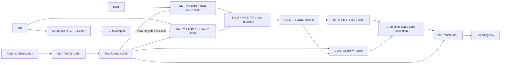

# TSAR-Ground：基于 RGBT-GroundBench 的模型设计方案

> **工作名**：TSAR-Ground（Thermal-Semantic Augmentation and Reliability Routing for RGB-T Visual Grounding）
> **基线仓库**：https://github.com/crazyxiaoxi/RGBT-GroundBench
> **基线模型**：RGBT-VGNet / `MMVGFusion` + `IAFv3`
> **方案版本**：v1.0（2026-09-10）
> **首要目标**：在不破坏官方 RGBT-VGNet 已验证优势的前提下，提高 RGBT Grounding 的热红外表征质量与语言条件下的模态可靠性建模能力，并以官方 Acc@0.5 / Acc@0.7 为主要验收指标。

---

## 1. 设计结论先行

本方案**不建议**将 TIR 分支的 CLIP 直接替换成 InfMAE、M-SpecGene 或其他纯视觉编码器。

原因是 RGBT-VGNet 的最大性能增益来自 AMA：作者通过 RGB/TIR 不对称 LoRA（RGB rank=16、TIR rank=48）适配 RGB 预训练 CLIP，已经证明“先保持视觉-语言语义空间，再强化 TIR 适配”非常重要。直接换掉 TIR CLIP 会同时改变：

1. TIR 的视觉表征空间；
2. Text→TIR 的 LAVS 交互分布；
3. RGB↔TIR Cross-Attention 的特征统计；
4. TPF/IAFv3 的可靠性建模输入；
5. 后续 VL Transformer 的训练分布。

因此本方案采用**Baseline-Preserving Enhancement（保基线增强）**：

```text
                       CLIP Text Encoder
                              │
                              │ text tokens / EOS
                              ▼
RGB ── CLIP ViT-B/16 + AMA ── LAVS ──┐
                                      │
                                      ├── GQR-enhanced TPF ── VL Transformer ── Box
                                      │
TIR ── CLIP ViT-B/16 + AMA ── LAVS ──┘
                 ▲
                 │ zero-init gated residual
                 │
             TERA Adapter
                 ▲
                 │
         M-SpecGene ViT-B
         (frozen thermal/RGBT expert)
```

最终方法只保留两个主创新点：

- **TERA：Thermal Expert Residual Adapter**
  在保留 TIR-CLIP+AMA 的前提下，引入跨谱预训练专家的 TIR 表征，通过零初始化门控残差注入，而不是替换 CLIP。

- **GQR：Grounding-Quality Reliability Router**
  在 IAFv3/TPF 的局部亮度、token、channel 先验之外，引入**由单模态 grounding 质量直接监督**的语言条件模态可靠性，学习“当前文本目标到底应该更信 RGB 还是 TIR”。

高分辨率训练和 Target-aware Alignment 作为**性能增强项**，不作为首轮必须同时上线的核心结构。

---

## 2. 官方基线与必须超过的指标

RGBT-GroundBench v2 的主要指标是 **Acc@0.5**，即预测框和 GT 的 IoU > 0.5 时记为正确。论文同时报告 Acc@0.7。

### 2.1 RGBT-VGNet 完整模型

完整模型为：

\[
\text{AMA}+\text{LAVS}+\text{TPF}
\]

最新版论文 Test 指标：

| 数据集 | Acc@0.5 Test | Acc@0.7 Test |
|---|---:|---:|
| RefFLIR | 72.43 | 53.85 |
| RefM3FD | 74.89 | 62.18 |
| RefMFAD | 67.58 | 55.16 |

因此本工作最终不能只和 `AMA+LAVS` 比，而必须和完整 RGBT-VGNet 比。

### 2.2 本项目验收线

建议分为三层：

| 层级 | Acc@0.5 要求 |
|---|---|
| Baseline 复现 | 与论文 Test 差值控制在 ±0.5 内 |
| 模块保留线 | 三数据集简单平均提升 ≥0.5，且任一数据集退化不超过 0.3 |
| 最终论文目标 | 三个 Test **全部超过**官方结果，平均提升至少 1.0 |
| Stretch Goal | RefFLIR ≥74.0，RefM3FD ≥76.3，RefMFAD ≥69.0 |

同时监控 Acc@0.7。若 Acc@0.5 提升而 Acc@0.7 明显下降，说明模型更多改善“粗定位”而不是精确框回归，不应视为充分成功。

---

## 3. 为什么这两个方向最值得改

### 3.1 瓶颈一：TIR 仍由 RGB 预训练 CLIP 处理

官方基线对 RGB 和 TIR 共用 CLIP ViT-B/16 结构，通过不同 LoRA rank 适配，其中 TIR rank 更高。论文消融说明 `(16,48)` 优于对称 `(32,32)`，表明 TIR 确实需要更强适配。

但更高 LoRA rank 仍属于：

\[
W_{TIR}=W_{CLIP}+\Delta W_{LoRA}
\]

它没有引入真正由大规模 RGB-T/Infrared 数据学习到的跨谱视觉先验。

M-SpecGene（ICCV 2025）提供 ViT-B 预训练权重，并以大规模 RGBT 数据进行自监督跨模态预训练，目标是学习 modality-invariant representation。因此，它更适合作为**额外 thermal expert**，而不是直接替换 CLIP。

### 3.2 瓶颈二：TPF/IAFv3 的可靠性不是 Grounding Quality

官方代码中的 `IAFv3` 计算：

- RGB illumination prior；
- RGB/TIR token difference；
- global channel gate；
- RGB-TIR residual difference。

可抽象为：

\[
w^{base}_{p}
=
\sigma(
l^{illum}_{p}
+l^{token}_{p}
+l^{channel}
)
\]

再进行：

\[
z_p=w^{base}_{p}v_p+(1-w^{base}_{p})t_p+\text{residual}(v_p-t_p)
\]

这是合理的局部融合先验，但它并没有被直接监督去回答：

> 对当前 referring expression，RGB-only 和 TIR-only 哪个模态能产生更正确的目标框？

论文消融也说明 TPF 的整体收益并非所有数据集都单调。例如 RefFLIR Test 从 AMA+LAVS 的 72.65 变为完整模型的 72.43，而在困难子集上更有收益。因此融合可靠性还有明确改进空间。

### 3.3 瓶颈三：小目标占比高，224×224 限制明显

RGBT-GroundBench 约：

- 43.2% weak-light；
- 56.8% small-object。

官方 RGBT-VGNet 默认输入为 224×224。仓库中的 `Modified_CLIPVisionEmbeddings` 已实现 CLIP positional embedding 的 bicubic interpolation，因此代码本身具备更高输入分辨率的基础。

这意味着“先把核心结构做对，再用 288/320 高分辨率微调”是一个低开发风险、但可能显著影响小目标性能的增强路径。

---

# 4. TSAR-Ground 总体结构

## 4.1 张量定义

以 CLIP ViT-B/16、输入 224×224 为例：

- batch：\(B\)
- patch grid：14×14
- patch 数：\(N=196\)
- hidden dim：\(D=512\)
- 文本长度：\(T=77\)

官方 `MMVGFusion` 中经过多层视觉特征拼接和投影后：

\[
V\in\mathbb{R}^{(N+1)\times B\times D}
\]

\[
TIR\in\mathbb{R}^{(N+1)\times B\times D}
\]

文本：

\[
S\in\mathbb{R}^{T\times B\times D}
\]

其中视觉 token 包含 CLS。

## 4.2 数据流



---

# 5. 创新一：TERA — Thermal Expert Residual Adapter

## 5.1 核心目标

不是：

\[
TIR\rightarrow M\text{-}SpecGene\rightarrow LAVS
\]

而是：

\[
TIR\rightarrow CLIP^{AMA}
\]

保持不变，同时增加：

\[
TIR\rightarrow M\text{-}SpecGene\rightarrow Adapter
\]

得到专家特征：

\[
E_t
\]

最终：

\[
\tilde T_t
=
T_t
+
\rho\cdot G_t\odot E_t
\]

其中：

- \(T_t\)：原 TIR-CLIP+AMA token；
- \(E_t\)：M-SpecGene 特征对齐到 512 维后的 token；
- \(G_t\)：可选语言条件门控；
- \(\rho=\tanh(\rho_{raw})\)；
- \(\rho_{raw}=0\) 初始化。

因此初始化时：

\[
\tilde T_t=T_t
\]

模型严格从原 baseline 附近开始，而不是随机破坏 TIR 表征。

## 5.2 Expert Feature Adapter

外部专家的 token 形态可能与 CLIP 不一致，因此定义统一适配器：

1. 接受 `[B,L,C_e]` 或 `[B,C_e,H,W]`；
2. 去掉专家 CLS（若存在）；
3. 恢复二维 grid；
4. 双线性插值到当前 CLIP patch grid；
5. `Linear/1×1 Conv: C_e→512`；
6. LayerNorm；
7. 输出 `[N+1,B,512]`。

### 5.3 第一版建议：expert 冻结

首轮实验：

```text
M-SpecGene backbone: frozen
TERA adapter: trainable
residual scale rho: trainable
CLIP AMA / LAVS: 保持官方训练策略
```

理由：

- 降低显存；
- 降低过拟合；
- 保留 M-SpecGene 的预训练先验；
- 更容易判断提升究竟来自“引入专家特征”，还是大规模额外参数微调。

只有当 frozen expert 明确涨点后，才试：

```text
unfreeze last 1~2 blocks
lr_expert = 1e-5
```

## 5.4 是否加入 Text-conditioned Expert Gate

第二阶段可加入：

\[
G_t=\sigma(MLP[\hat T_t,\hat E_t,s])
\]

其中 \(s\) 为 text EOS embedding。

第一轮不建议直接上复杂 token gate；先只使用 scalar residual \(\rho\)，减少变量。

---

# 6. 创新二：GQR — Grounding-Quality Reliability Router

这是本方案最重要的主创新。

## 6.1 设计问题

IAFv3 当前的权重更接近：

\[
P(\text{RGB reliable}\mid RGB,TIR)
\]

而 Visual Grounding 真正需要：

\[
P(
\text{RGB better for target}
\mid
RGB,TIR,\text{text}
)
\]

因此必须让 reliability 显式看到**文本目标**，并接受**grounding quality**监督。

## 6.2 辅助单模态 Grounding Head

对 RGB 和 TIR 分别增加一个轻量 head，不使用完整 VL Transformer，控制计算量。

对某模态视觉 patch \(X_m\)：

\[
a_m=
softmax
\left(
\frac{q_sK_m^T}{\sqrt D}
\right)
\]

\[
h_m=a_mV_m
\]

将：

\[
[h_m,s,cls_m]
\]

送入 MLP：

\[
B_m=\sigma(MLP_m([h_m,s,cls_m]))
\]

得到：

\[
B_{rgb}, B_{tir}
\]

训练时给两个 auxiliary heads 较小的 bbox/GIoU loss，使它们具备基本定位能力。

## 6.3 用 GT 构造 Reliability Teacher

只在训练阶段使用 GT：

\[
q_{rgb}=IoU(B_{rgb}^{detach},B_{gt})
\]

\[
q_{tir}=IoU(B_{tir}^{detach},B_{gt})
\]

soft teacher：

\[
r^*=
softmax
\left(
\frac{[q_{rgb},q_{tir}]}{\tau}
\right)
\]

注意必须 `detach()` 两个辅助框再生成 teacher，避免辅助 head 通过“操纵 teacher”降低 router loss。

## 6.4 Router 输入

使用文本条件的跨模态特征：

\[
u=[
h_{rgb},
h_{tir},
|h_{rgb}-h_{tir}|,
s
]
\]

\[
r=softmax(MLP_{router}(u))
\]

输出：

\[
r=[r_{rgb},r_{tir}]
\]

训练：

\[
L_{router}
=
KL(r^*\Vert r)
\]

## 6.5 不替换 IAFv3，而是修正其 logit

这是降低性能回退风险的关键。

假设 IAFv3 已得到 patch RGB 权重：

\[
w^{base}_p
\]

先转成 logit：

\[
l_p^{base}
=
logit(clamp(w_p^{base},\epsilon,1-\epsilon))
\]

GQR 给出 sample-level RGB reliability：

\[
r_{rgb}
\]

则：

\[
l_p^{final}
=
l_p^{base}
+
\eta(2r_{rgb}-1)
\]

\[
w_p^{final}=\sigma(l_p^{final})
\]

其中：

\[
\eta=\eta_{max}\tanh(\eta_{raw})
\]

并令：

\[
\eta_{raw}=0
\]

初始化。

所以初始：

\[
w_p^{final}=w_p^{base}
\]

即 GQR 不会在训练开始时破坏官方 IAFv3。

### 为什么用 logit residual 而不是线性平均

不建议：

\[
w=\lambda w_{TPF}+(1-\lambda)r
\]

因为这会压缩原有 patch-wise reliability 的动态范围。

logit correction 更自然：

- IAFv3 负责局部 patch reliability；
- GQR 负责 language-conditioned sample-level modality bias；
- 两者是加性证据而不是互相覆盖。

---

# 7. 可选增强：Target-aware Thermal-Text Alignment

此模块只在 TERA 单独验证有效后启用。

目标不是强制整幅 TIR 图与文本对齐，而是只对 GT 目标区域做语义对齐。

使用训练数据已有 `obj_mask`，下采样至 patch grid，得到 \(M\)。

专家目标 prototype：

\[
p_e=
\frac{\sum_iM_iE_i}{\sum_iM_i+\epsilon}
\]

TIR-CLIP prototype：

\[
p_t=
\frac{\sum_iM_iT_i}{\sum_iM_i+\epsilon}
\]

Text EOS：

\[
s
\]

推荐使用：

\[
L_{ta}
=
L_{InfoNCE}(p_e,s)
+
\lambda_{ct}(1-\cos(p_e,p_t))
\]

注意：

- GT mask 只用于 training loss；
- inference 不使用 GT；
- 不要做全局强制 RGB/TIR feature equality，否则可能削弱跨谱互补信息。

默认：

\[
\lambda_{ta}=0.05
\]

从较小权重开始。

---

# 8. 高分辨率增强策略

这部分优先作为最终 best model 的 enhancement，而不是论文唯一创新。

官方代码已经能插值 CLIP positional embeddings，因此建议做：

### Stage-HR1

\[
224\rightarrow288
\]

如果显存允许：

### Stage-HR2

\[
224/288\rightarrow320
\]

ViT-B/16 token 数：

| 输入 | Grid | Patch token |
|---|---:|---:|
| 224 | 14×14 | 196 |
| 288 | 18×18 | 324 |
| 320 | 20×20 | 400 |
| 336 | 21×21 | 441 |

注意 VL Transformer 的 attention 复杂度随序列长度平方增长，因此首选 288 或 320，不建议第一轮直接 336。

论文必须同时报告：

- 224×224 matched-resolution；
- best high-resolution result。

否则 reviewer 容易认为性能提升主要来自输入分辨率而非结构设计。

---

# 9. 总损失

官方：

\[
L_{base}
=
2L_{bbox}
+
2L_{giou}
+
L_{contrastive}
+
20L_{rtcc-focal}
+
2L_{rtcc-dice}
+
20L_{seg-focal}
+
2L_{seg-dice}
\]

保持不动。

增加：

\[
L_{auxbox}
=
\lambda_{aux}
(
L_{box}^{rgb}
+
L_{box}^{tir}
)
\]

\[
L_{gqr}
=
\lambda_{gqr}KL(r^*\Vert r)
\]

可选：

\[
L_{ta}=\lambda_{ta}L_{target-align}
\]

最终：

\[
\boxed{
L=
L_{base}
+
L_{auxbox}
+
L_{gqr}
+
L_{ta}
}
\]

推荐初始值：

```yaml
lambda_aux: 0.25
lambda_gqr: 0.20
lambda_target_align: 0.05
gqr_tau: 0.25
gqr_start_epoch: 5
```

前 5 epoch 允许辅助单模态 head 先获得基本定位能力，再逐步启用 GQR teacher loss。

推荐线性 ramp：

\[
\lambda_{gqr}(e)
=
\lambda_{gqr}^{max}
\cdot
clamp
\left(
\frac{e-e_0}{5},0,1
\right)
\]

---

# 10. 推荐训练顺序

不要一次训练“全部模块”。

## E0：官方完整 baseline

```text
MMVGFusion
FusionMethod=IAFv3
RGB LoRA=16
TIR LoRA=48
LAVS=on
224×224
```

要求先复现接近论文指标。

## E1：GQR only

```text
baseline
+ auxiliary RGB/TIR grounding heads
+ GQR logit correction
```

这是最优先实验。

保留标准：

- 三数据集平均 +0.5；
- 任一数据集不降 >0.3；
- testB/testC 有清晰提升更佳。

## E2：TERA only

```text
baseline
+ frozen M-SpecGene ViT-B
+ projection adapter
+ zero-init residual
```

如果 E2 不涨，先不要加入 target alignment；检查 expert feature level、grid alignment、归一化和 checkpoint。

## E3：GQR + TERA

测试两者是否互补。

理想现象：

- TERA 提高 TIR/small/low-light 表征；
- GQR 提高按文本动态选择模态的能力；
- 组合提升大于单独模块。

## E4：+ Target-aware Alignment

只有 E2 有效时再开。

## E5：Best model + 288/320 HR finetune

作为最终性能版。

---

# 11. 消融矩阵

| Exp | AMA | LAVS | IAFv3 | TERA | GQR | Target Align | HR | 目的 |
|---|---|---|---|---|---|---|---|---|
| A0 | ✓ | ✓ | ✓ | | | | | 官方 baseline |
| A1 | ✓ | ✓ | ✓ | | ✓ | | | GQR 主增益 |
| A2 | ✓ | ✓ | ✓ | ✓ | | | | Thermal expert |
| A3 | ✓ | ✓ | ✓ | ✓ | ✓ | | | 主模型 |
| A4 | ✓ | ✓ | ✓ | ✓ | ✓ | ✓ | | 目标级对齐 |
| A5 | ✓ | ✓ | ✓ | ✓ | ✓ | ✓ | 288/320 | Best |
| B1 | ✓ | ✓ | | | GQR-direct | | | 验证 IAFv3 residual 的必要性 |
| B2 | ✓ | ✓ | ✓ | InfMAE | ✓ | | | Expert 对比 |
| B3 | ✓ | ✓ | ✓ | M-SpecGene | ✓ | | | 推荐专家 |
| B4 | ✓ | ✓ | ✓ | M-SpecGene | no-text GQR | | | 验证语言条件 |
| B5 | ✓ | ✓ | ✓ | M-SpecGene | GQR | global align | | 验证 target-aware 优势 |

---

# 12. 必须记录的诊断指标

除了 Acc@0.5 / Acc@0.7，建议保存：

### GQR

- `router_rgb_mean`
- `router_tir_mean`
- low-light 下 `router_tir_mean`
- normal-light 下 `router_rgb_mean`
- small-object 下两个权重
- `teacher_rgb_mean / teacher_tir_mean`
- router teacher accuracy：
  \[
  argmax(r)=argmax(r^*)
  \]

### TERA

- `rho`
- expert residual L2 ratio：
  \[
  \frac{\|\rho E\|_2}{\|T_{tir}\|_2}
  \]
- target prototype cosine；
- TIR-only auxiliary Acc@0.5。

如果 `rho≈0` 全程不动，说明专家没有被使用；如果 residual ratio 很大且验证集下降，说明专家注入过强。

---

# 13. 风险与回滚规则

## 风险 1：M-SpecGene 接入导致 domain mismatch

处理顺序：

1. 冻结 expert；
2. 检查输入归一化；
3. 检查 patch 对齐；
4. 检查 `Linear→LayerNorm`；
5. residual scale 限制在较小范围；
6. 若仍下降，先保留 GQR，移除 expert。

## 风险 2：Router teacher 早期噪声大

措施：

- aux head warmup 5 epoch；
- teacher 使用 detached IoU；
- soft target 不用 hard argmax；
- temperature 先 0.25；
- router loss ramp。

## 风险 3：GQR 过度覆盖 IAFv3

措施：

- 使用 logit residual；
- `eta_raw=0`；
- 限制 `eta_max`；
- 对比 `GQR-direct` 与 `IAFv3+GQR residual`。

## 风险 4：高分辨率提升掩盖结构贡献

论文主表先比较 224×224，HR 放 best model / supplementary。

---

# 14. 论文创新点建议写法

不要写成：

> We replace the TIR CLIP encoder with M-SpecGene.

这只是 backbone replacement。

建议形成以下两点。

### Contribution 1：Thermal Expert Residual Adaptation

> We retain the language-compatible CLIP thermal stream and augment it with a cross-spectrally pretrained thermal expert through a zero-initialized gated residual adapter, introducing thermal-specific priors without destroying the pretrained vision-language space.

### Contribution 2：Grounding-Supervised Reliability Routing

> We formulate RGB-TIR reliability as a language-conditioned grounding-quality estimation problem. Modality-specific auxiliary grounding predictions construct soft reliability supervision, which corrects the original local fusion weights in logit space.

这两个贡献形成清晰逻辑：

\[
\boxed{
更强的TIR视觉证据
\quad+\quad
更正确的文本条件模态选择
}
\]

而不是模块堆叠。

---

# 15. 最终建议版本

如果实验资源有限，按以下优先级：

```text
优先级 1：复现 MMVGFusion + IAFv3
优先级 2：GQR
优先级 3：TERA(M-SpecGene)
优先级 4：GQR + TERA
优先级 5：Target-aware alignment
优先级 6：288/320 高分辨率 finetune
```

**不建议第一版做：**

- 直接删除 TIR CLIP；
- 直接删除 AMA；
- 一次加入 4~5 个复杂模块；
- 直接用 GT 作为 inference routing 信息；
- 全图强制 RGB/TIR/Text embedding 完全一致；
- 只报告高分辨率结果。

---

# 16. 参考资料

1. RGBT-GroundBench / RGBT-VGNet
   https://arxiv.org/abs/2512.24561
   https://github.com/crazyxiaoxi/RGBT-GroundBench

2. M-SpecGene: Generalized Foundation Model for RGBT Multispectral Vision, ICCV 2025
   https://github.com/CalayZhou/M-SpecGene
   https://openaccess.thecvf.com/content/ICCV2025/html/Zhou_M-SpecGene_Generalized_Foundation_Model_for_RGBT_Multispectral_Vision_ICCV_2025_paper.html

3. InfMAE: A Foundation Model in the Infrared Modality, ECCV 2024
   https://github.com/liufangcen/InfMAE

4. GigaGrounding, CVPR 2024
   https://openaccess.thecvf.com/content/CVPR2024/html/Ma_When_Visual_Grounding_Meets_Gigapixel-level_Large-scale_Scenes_Benchmark_and_Approach_CVPR_2024_paper.html

5. Small Object, Great Challenge: A Benchmark for Small Object Visual Grounding, CVPR 2026
   https://openaccess.thecvf.com/content/CVPR2026/papers/Jia_Small_Object_Great_Challenge_A_Benchmark_for_Small_Object_Visual_CVPR_2026_paper.pdf

---

## 17. 最重要的实验原则

本方案是为了**提高超过 RGBT-VGNet 的概率**，不是声称未经训练即可保证涨点。

真正的 Go/No-Go 判断必须来自同一数据划分、同一分辨率、同一训练预算下的严格消融。

如果 GQR 能在 224×224 下稳定提升，而 TERA 不能，则最终论文可以只保留 GQR 并继续深化 reliability learning；不要为了“看起来创新更多”保留无增益模块。
